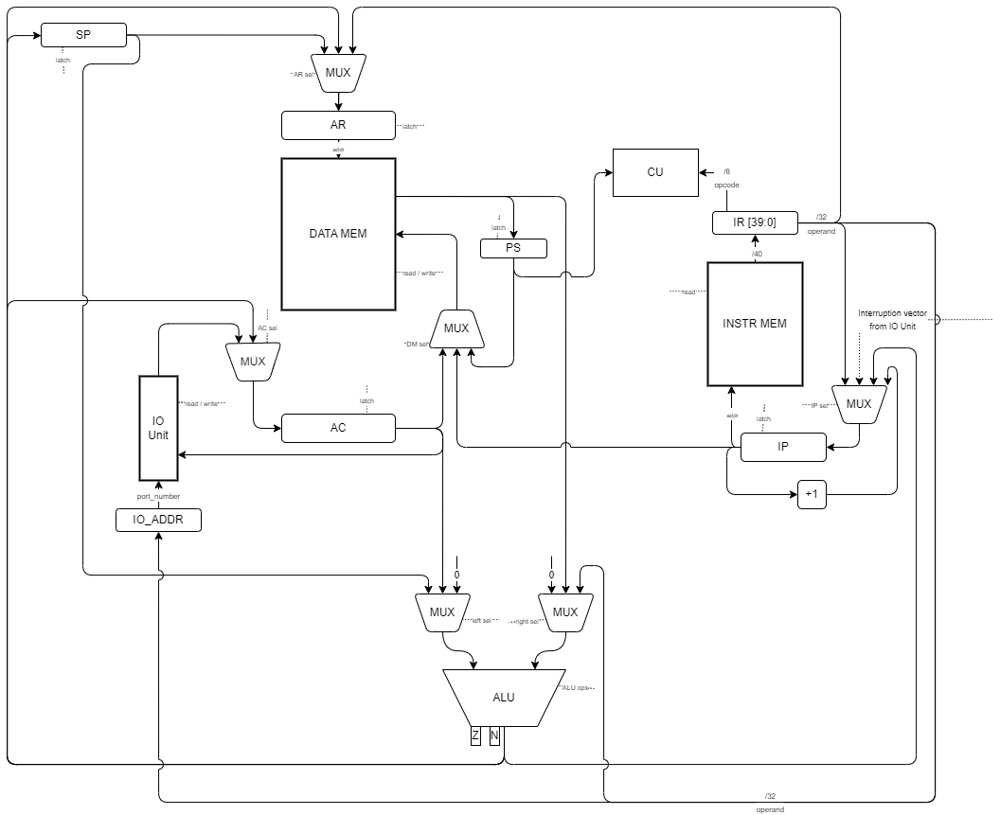
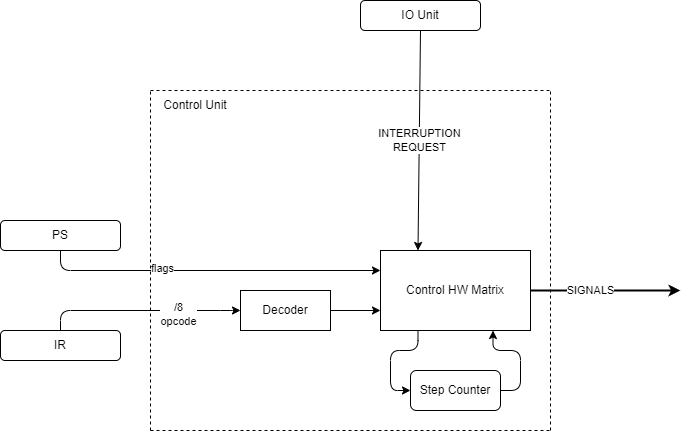

# CSA - Лабораторная работа №4 

* **Храбров Артём Алексеевич**
* **Р3215**
* **Вариант:** `lisp | acc | harv | hw | tick | binary | trap | port | cstr | prob2 | superscalar`

## Оглавление

- [Расшифровка варианта](#расшифровка-варианта)
- [Язык программирования Lisp](#язык-программирования-lisp)
  - [Синтаксис](#синтаксис)
  - [Семантика](#семантика)
  - [Примеры кода](#примеры-кода)
- [Организация памяти](#организация-памяти)
  - [Модель памяти](#модель-памяти)
  - [Размещение программы и данных](#размещение-программы-и-данных)
- [Система команд](#система-команд)
  - [Особенности процессора](#особенности-процессора)
  - [Кодирование инструкций](#кодирование-инструкций)
- [Модель процессора](#модель-процессора)
  - [Data Path](#data-path)
  - [Control Unit](#control-unit)
- [Ввод-вывод и прерывания](#ввод-вывод-и-прерывания)
- [Моделирование и конфигурация](#моделирование-и-конфигурация)
- [Формат бинарного файла](#формат-бинарного-файла)
- [Транслятор](#транслятор)
  - [Интерфейс командной строки](#интерфейс-командной-строки)
  - [Этапы трансляции](#этапы-трансляции)
  - [Особенности трансляции сложных выражений](#особенности-трансляции-сложных-выражений)
- [Тестирование](#тестирование)
  - [Перечень golden-тестов](#перечень-golden-тестов)
  - [Пример прогона цепочки](#пример-прогона-цепочки)
  - [Запуск](#запуск)

## Расшифровка варианта

| Задание | Вариант | Описание                                                                                                                        |
| :--- | :--- |:--------------------------------------------------------------------------------------------------------------------------------|
| **Язык программирования** | `lisp` | **S-expressions**. Программа представляет собой вложенные списки. Поддержка функций, условий и арифметики.                      |
| **Архитектура** | `acc` | **Аккумуляторная архитектура**. Основные операции выполняются с участием регистра-аккумулятора (AC).                            |
| **Организация памяти** | `harv` | **Гарвардская архитектура**. Физически раздельные память команд и память данных.                                                |
| **Control Unit** | `hw` | **Hardwired**. Реализуется как часть модели.                                                                                    |
| **Точность модели** | `tick` | **Потактовое моделирование**. Логирование состояния процессора на каждом такте.                                                 |
| **Представление кода** | `binary` | **Бинарный формат**. Транслятор генерирует исполняемый файл в бинарном представлении.                                           |
| **Ввод-вывод** | `trap` | **Прерывания**. Механизм обработки запросов от устройств ввода-вывода.                                                          |
| **Ввод-вывод ISA** | `port` | **Port-mapped I/O**. Использование специальных инструкций (`IN`, `OUT`) для обращения к портам ввода-вывода.                    |
| **Поддержка строк** | `cstr` | **Null-terminated strings**. Строки хранятся как последовательность байт, заканчивающаяся нулем.                                |
| **Алгоритм** | `prob2` | **Sum square difference**. Разность квадрата суммы первых 100 натуральных чисел и суммы их квадратов.                           |
| **Усложнение** | `superscalar` | **Суперскалярная организация**. Возможность параллельного исполнения нескольких инструкций за такт при отсутствии зависимостей. |


## Язык программирования Lisp

### Синтаксис
Язык является диалектом Lisp, построенным на основе S-выражений. 

**Форма Бэкуса-Наура:**

```bnf
<program>          ::= <expression> <program> | <expression>

<expression>       ::= <atom> | <list>

<list>             ::= "(" <list_body> ")"

<list_body>        ::= <special_form>
                     | <operator_call>
                     | <function_call>

<special_form>     ::= "def" <symbol> <expression>
                     | "set" <symbol> <expression>
                     | "if" <expression> <expression> <expression>
                     | "while" <expression> <expression>
                     | "block" <expression_list>
                     | "lambda" "(" <parameter_list> ")" <expression>
                     | "out" <number> <expression>
                     | "out-str" <number> <expression>
                     | "in" <number>
                     | "interrupt-handler" <number> <expression>
                     | "alloc" <number>
                     | "array" <expression_list>
                     | "aref" <expression> <expression>
                     | "aset" <expression> <expression> <expression>

<operator_call>    ::= <variadic_op> <expression> <expression_list>
                     | <binary_op> <expression> <expression>

<function_call>    ::= <symbol> <expression_list>

<variadic_op>      ::= "+" | "-" | "*" | "/" | "%"
<binary_op>        ::= "=" | "<" | ">"

<expression_list>  ::= <expression> <expression_list> | ""
<parameter_list>   ::= <symbol> <parameter_list> | ""

<atom>             ::= <boolean> | <number> | <string> | <symbol>

<boolean>          ::= "#t" | "#f"
<number>           ::= "-"? [0-9]+
<string>           ::= '"' [^"]* '"'
<symbol>           ::= [a-zA-Z_][a-zA-Z0-9_!-]*
```

### Семантика

#### Особенности языка
*  **Функции высшего порядка** — возможность передавать функции в функцию и возвращать функцию как результат.
*  **Переменное число аргументов** — математические операторы и функции могут принимать переменное число аргументов: `(+ 1 2 3 4 .. n)`, `(- 1 2 3 4 .. n)`. Вычисление происходит слева направо.
*  **Отсутствие типизации** — значения представляют собой сырые 32-битные данные. Типы существуют только как соглашение и не контролируются.
#### Стратегия вычислений
Используется **аппликативный порядок вычислений**. Все аргументы выражения вычисляются рекурсивно до того, как к ним будет применен оператор или вызвана функция.
#### Области видимости
*   **Глобальная область видимости**: Переменные, объявленные через `def` вне тела функций, доступны во всей программе.
*   **Функциональная область видимости**: Параметры, объявленные в `lambda`, доступны только внутри тела данной функции. 
*   **Затенение**: Локальные переменные перекрывают одноименные глобальные переменные на время выполнения функции.

#### Типизация и литералы
Язык без типизации, каждое значение занимает 32 бита. Целостность данных должен обеспечивать программист.

Литералы:
*   **Number**: 32-битное целое знаковое (`42`, `-7`).
*   **Boolean**: `#t` и `#f` (транслируются в `1` и `0`).
*   **String/cstr**: null-terminated последовательность байт (`"Hello"`).
*   **Symbol**: имя переменной или функции.

#### Конструкции языка
*   `def`: Резервирует ячейку в памяти данных и связывает её с именем переменной.
*   `set`: Задаёт новое значение переменной.
*   `if`: Вычисляет условие. При истинном значении исполняет ветку then, иначе else.
*   `while`: Повторяет тело, пока условие истинно.
*   `block`: Позволяет записать последовательность выражений. Необходим для улучшения читаемости кода. Результат блока — результат последнего выражения.
*   `lambda`: Создаёт анонимную функцию. Результат вычисления — адрес функции в памяти.
*   `out` / `in`: Вывод в порт / чтение значения из порта.
*   `out-str`: Посимвольный вывод cstr-строки в порт до нуль-терминатора.
*   `interrupt-handler`: Связывает номер прерывания с обработчиком-`lambda` функцией.
*   `alloc` / `array`: Выделяют блок в памяти данных, возвращают адрес. Нужно для реализации массивов.
*   `aref` / `aset`: Чтение / запись элемента по адресу массива и смещению. Можно использовать также для строк.

#### Точка входа и комментарии
*   **Точка входа**: Программа — это последовательность выражений, которые исполняются сверху вниз. Нет явной точки входа.
*   **Комментарии**: однострочные, начинаются с `;` и отбрасываются на этапе токенизации.

### Примеры кода

**1. `if` как выражение:**
```lisp
(def x -5)
; if — это выражение, его результат можно использовать напрямую
(out 0 (if (< x 0) (- 0 x) x))   ; -> 5  (модуль числа)

; результат if используется в определении переменной
(def sign (if (< x 0) -1 1))
(out 0 sign)                       ; -> -1
```

**2. Функции высшего порядка:**
```lisp
  (def add (lambda (a b) (+ a b)))
  (def sub (lambda (a b) (- a b)))
  (def mul (lambda (a b) (* a b)))
  
  ; Аргумент fun функции apply является функцией
  (def apply (lambda (fun a b) (fun a b)))
  
  (out 1 (apply add 1 2)) ; -> 3
  (out 1 (apply sub 1 2)) ; -> -1
  (out 1 (apply mul 1 2)) ; -> 2
```

**3. Циклы и арифметика:**
```lisp
(def i 0)
(while (< i 100)
    (block
        (set i (+ i 1))
        (out 0 i)))
```

**4. Обработчик прерывания:**
```lisp
; Обработчик порта 1: читает символ из порта и выводит обратно
(interrupt-handler 1 (lambda ()
    (out 1 (in 1))))

(while #t 0)
```

## Организация памяти

### Модель памяти
В системе реализована **Гарвардская архитектура**: память команд и память данных физически разнесены.
* **Размер машинного слова**: 32 бита.
* **Размер инструкции**: 40 бит.
* **Операнд**: 32 бита.
* **Режимы адресации**: непосредственный, прямой абсолютный, косвенный,  относительно вершины стека.

**Регистры:**
* `AC` Accumulator: основной рабочий регистр для арифметики и IO.
* `IP` Instruction Pointer: адрес следующей команды.
* `SP` Stack Pointer: указатель на свободную ячейку в вершине стека.
* `AR` Address Register: адрес для обращения к памяти данных.
* `IR` Instruction Register: текущая выбранная инструкция (40 бит).
* `PS` Processor State: флаги `Z`, `N`, `IE` (interrupt enable).
* `IO_ADDR`: номер порта для текущей операции `IN`/`OUT`.

**Схема распределения памяти:**

```text
       Instruction memory
+----------------------------------------------+
| 0x00        : JMP 0x11                       |
| 0x01 - 0x10 : interrupt vectors              |
| 0x11 - ...  : program code                   |
| ...         : procedures, interrupt handlers |
+----------------------------------------------+

          Data memory
+------------------------------+
| 0x00 - ... : static data     |
| ...        : ...             |
| ...        : stack           |
| 0xFFFFFF   : stack bottom    |
+------------------------------+
```

### Размещение программы и данных
* **Инструкции** лежат в памяти команд: по адресу `0x00` — переход на точку входа, `0x01–0x10` — таблица векторов прерываний, с `0x11` — код программы, далее тела функций и обработчиков.
* **Литералы**: числовые константы попадают прямо в операнд инструкции через непосредственные формы, без обращения к памяти данных.
* **Строки (cstr)** размещаются в статической памяти данных посимвольно — один символ на 32-битное слово, последнее слово — нулевой терминатор. В коде хранится адрес первого символа; `out-str` обходит ячейки подряд до нуля, выводя каждый символ в порт..
* **Глобальные переменные** получают по выделенной ячейке в статической памяти данных и адресуются напрямую.
* **Параметры функций** хранятся не в статической памяти, а на стеке и адресуются относительно вершины стека, что делает вызовы устойчивыми к рекурсии.
* **Массивы** — это непрерывный блок ячеек в статической памяти, доступ к элементам идёт косвенной адресацией.
* **Стек** растёт вниз от конца памяти данных и хранит промежуточные значения выражений, аргументы вызовов и адреса возврата.

## Система команд

### Особенности процессора
* Все вычисления идут через регистр `AC`, второй операнд берётся из памяти или из самой инструкции.
* Обмен с портами ввода-вывода выполняется отдельными командами `IN`/`OUT` через `AC`.
* Вызов и возврат функций — через аппаратный стек. Прерывания — аппаратным сохранением контекста.

### Кодирование инструкций
Инструкции имеют фиксированный формат в 40 бит и кодируются в бинарном представлении следующим образом:

```text
|   Opcode (8 bits)   |         Operand (32 bits)            |
| 39 . . . . . . . 32 | 31 . . . . . . . . . . . . . . . . 0 |
```

* **Opcode**: Код операции из таблицы.
* **Operand**: Прямой 32-битный адрес либо знаковое 32-битное число.

В колонке «Такты» указан полный цикл команды: выборка + исполнение.

| Команда       | Опкод | Такты | Описание                                       |
|:--------------|:------|:------|:-----------------------------------------------|
| **LD addr**   | 0x01  | 3     | AC <- Mem[addr]                                |
| **ST addr**   | 0x02  | 3     | Mem[addr] <- AC                                |
| **LDI imm**   | 0x03  | 2     | AC <- imm (32-bit immediate)                   |
| **LDA**       | 0x05  | 3     | AC <- Mem[AC]                                  |
| **LID addr**  | 0x06  | 4     | AC <- Mem[Mem[addr]]                           |
| **SID addr**  | 0x07  | 4     | Mem[Mem[addr]] <- AC                           |
| **ADD addr**  | 0x10  | 3     | AC <- AC + Mem[addr]                           |
| **SUB addr**  | 0x11  | 3     | AC <- AC - Mem[addr]                           |
| **MUL addr**  | 0x12  | 3     | AC <- AC * Mem[addr]                           |
| **DIV addr**  | 0x13  | 3     | AC <- AC / Mem[addr]                           |
| **MOD addr**  | 0x14  | 3     | AC <- AC % Mem[addr]                           |
| **ADDI imm**  | 0x15  | 2     | AC <- AC + imm                                 |
| **SUBI imm**  | 0x16  | 2     | AC <- AC - imm                                 |
| **MULI imm**  | 0x17  | 2     | AC <- AC * imm                                 |
| **DIVI imm**  | 0x18  | 2     | AC <- AC / imm                                 |
| **MODI imm**  | 0x19  | 2     | AC <- AC % imm                                 |
| **CMP addr**  | 0x20  | 3     | Обновить флаги Z, N на основе (AC - Mem[addr]) |
| **NOT**       | 0x21  | 2     | AC <- ~AC                                      |
| **CMPI imm**  | 0x22  | 2     | Обновить флаги Z, N на основе (AC - imm)       |
| **JMP addr**  | 0x30  | 2     | IP <- addr                                     |
| **JZ addr**   | 0x31  | 2     | IP <- addr (если Z=1)                         |
| **JNZ addr**  | 0x32  | 2     | IP <- addr (если Z=0)            |
| **JN addr**   | 0x33  | 2     | IP <- addr (если N=1)              |
| **CALL**      | 0x40  | 5     | Push(IP); IP <- AC                             |
| **RET**       | 0x41  | 4     | IP <- Pop()                                    |
| **PUSH**      | 0x42  | 4     | Mem[SP] <- AC; SP--                            |
| **POP**       | 0x43  | 4     | SP++; AC <- Mem[SP]                            |
| **LDS**       | 0x44  | 3     | AC <- Mem[SP + offset]                         |
| **STS**       | 0x45  | 3     | Mem[SP + offset] <- AC                         |
| **IN port**   | 0x50  | 3     | AC <- Port[port]                               |
| **OUT port**  | 0x51  | 3     | Port[port] <- AC                               |
| **IRET**      | 0x61  | 10    | Restore Context; (PS, AC, IP)                  |

## Модель процессора

Модель разделена на **Data Path** и **Control Unit**. Регистры реализованы как защёлки, замыкаемые отдельными управляющими сигналами. На каждом такте Control Unit подаёт набор сигналов, а Data Path их исполняет.

### Data Path



* **АЛУ** выполняет `+`, `-`, `*`, `/`, `%`, `INC`, `DEC`, `NOT`, `CMP` и выставляет флаги `Z` и `N`.
* **Память данных** адресуется регистром `AR`
* **IO Unit** обслуживает порты, адресуемые `IO_ADDR`, по сигналам чтения/записи.

### Control Unit

Реализован как **Hardwired**, в модели реализован на базе **FSM**. Управляющая матрица с помощью дешифратора опкода и счётчика шагов формирует на каждом такте набор управляющих сигналов.



Состояния процессора:
1. **FETCH**: Выборка команды из `INSTR MEM` в регистр инструкций `IR` с одновременным инкрементом `IP = IP + 1`. Занимает один такт.
2. **EXECUTE**: Исполнение последовательности сигналов для каждого опкода.
3. **INTERRUPT**: В конце исполнения инструкции, если есть запрос прерывания и прерывания разрешены, аппаратно сохраняется контекст (`PS`, `AC`, `IP`) на стек, прерывания запрещаются, а `IP` переходит на вектор прерывания.

---

## Ввод-вывод и прерывания

Используется **Port-mapped I/O**:
1. **Запрос**: Внешнее устройство кладёт данные в порт и устанавливает сигнал `IRQ`, а также номер своего вектора прерывания.
2. **Прерывание**: когда CU переходит в состояние INTERRUPT и видит `IRQ`, то сохраняет контекст и переходит на обработчик прерывания по выставленному вектору.
3. **Ввод**: Происходит чтение в `AC` из порта, указанного в регистре `IO_ADDR`.
4. **Вывод**: Происходит запись `AC` в порт, указанный в `IO_ADDR`.

Так как контроллеры ВУ отсутствуют, то каждое ВУ работает независимо от других. Если процессор физически не успевает обработать прерывание от ВУ-1, а ВУ-2 уже генерирует новое прерывание, то прерывание ВУ-1 может быть либо утеряно, либо некорректно обработано процессором.

---

## Моделирование и конфигурация

Параметры запуска задаются в файле `config.yml`:
* `limit`: ограничение по количеству тактов.
* `memory-size`: размер памяти данных.
* `io-ports`: расписание внешних событий.
* `show-signals`: логирование сигналов передаваемых на схему.

Симулятор выступает в роли посредника между реальным миром и процессором. Он инициирует такты, обновляя состояние `ControlUnit` и управляет логикой внешних устройств, отправляя запросы прерываний и записывая данные в порты.

## Формат бинарного файла

1) Заголовок (16 байт)

    - Magic number (4 байта): `4C 49 53 50` = `LISP`.
    - Section Count (4 байта): число записей в таблице секций.
    - Instr Size (4 байта): размер памяти команд в словах.
    - Data Size (4 байта): размер памяти данных в словах.

2) Таблица секций (N записей, каждая 9 байт)
    - Section Type (1 байт): `0x01` — Code, `0x02` — Data.
    - Start Address (4 байта): адрес в памяти процессора, с которого загружается секция.
    - Element Count (4 байта): число элементов в секции.

3) Тело

    Данные всех секций идут подряд в том же порядке, в каком они перечислены в таблице секций. Размер элементов секций:
    - Code: 5 байт.
    - Data: 4 байта.

## Транслятор

Транслятор преобразует исходный код на языке Lisp в бинарный файл.

### Интерфейс командной строки

```
python -m src.main compile <source.lisp> <output.bin> [listing.txt]
python -m src.main run     <config.yml>
```

* `compile` — транслирует исходник в бинарный файл. Если указан `listing.txt`, дополнительно пишет отладочный листинг.
* `run` — запускает симуляцию по конфигу.

Листинг имеет вид `<адрес> - <HEX-код> - <мнемоника> <операнд> ; <комментарий>` с заголовками секций.

### Этапы трансляции
1.  **Парсинг и синтаксический анализ**:
    *   **Токенизация**: Разбиение текста на токены, удаление комментариев.
    *   **Построение AST**: Превращение токенов в типизированные узлы. На этом этапе проверяется корректность структуры программы.
2.  **Генерация кода**:
    *   **Рекурсивный обход дерева.** Рекурсивно генерируется код для каждого из узлов. Результат вычисления любого выражения всегда остается в аккумуляторе.
    *   **Отложенная генерация**: Тела функций `lambda` не встраиваются в основное тело программы, а транслируются после основного кода программы. Это изолирует код функций от линейного потока исполнения.
3.  **Позднее связывание**:
    *   Замена операнда-заглушки на реальный адрес тела функции во всех инструкциях, ожидающих трансляции тела функции.
4.  **Сборка бинарного файла**
    *   Происходит выгрузка образа статической памяти и последовательности инструкций и дальнейшая упаковка в бинарный файл.
* **Позднее связывание** — механизм, позволяющий транслировать тело функции отдельно от основного кода и связывать переменную с адресом функции на позднем этапе генерации кода.
  * При первичном рекурсивном проходе узлы, определяющие тело функции `lambda` помещаются в очередь отложенной трансляции. Каждая функция получает уникальный `uid`.
  * Так как необходимо результатом вычисления выражения вернуть адрес тела функции, но он еще не определён, то адрес заменяется на `0xCCCCCCCC`, а инструкция помещается в очередь для отложенного связывания, с указанием `uid` интересующей функции.
  * После завершения трансляции основного кода происходит трансляция всех тел функций из очереди. На этом этапе для каждого `uid` определяется окончательный адрес.
  * Последним этапом является проход по очереди ожидающих инструкций. С помощью требуемого `uid` определяется реальный адрес и записывается в операнд вместо `0xCCCCCCCC`. После этого каждая инструкция окончательно связана с адресом функции.
### Особенности трансляции сложных выражений
В аккумуляторной архитектуре вложенные вычисления `(+ (* a b) (* c d))` требуют сохранения промежуточных результатов. 
*   **Использование стека**: Для сохранения контекста левого операнда используется аппаратный стек. Это делает транслятор устойчивым к рекурсии.
*   **Временная переменная**: Для накопления результата в выражениях большой вложенности используется временная статическая переменная.
*   **Оптимизация констант**: Если аргументом является число, транслятор генерирует инструкции с непосредственной адресацией (`ADDI`, `SUBI`, `CMPI`), минуя обращения к памяти данных.

## Тестирование

Тестирование построено на **golden-тестах**: каждый кейс — это YAML-файл в `tests/`, описывающий исходник, расписание ввода по портам и эталоны, с которыми сравнивается результат:
* `source` — исходный код на Lisp и `ports-input` — расписание внешних событий `{порт: [[такт, значение], ...]}`;
* `expected_ast` — ожидаемое дерево разбора;
* `expected_listing` — ожидаемый листинг машинного кода;
* `expected_output` — ожидаемые данные на выходных портах;
* `expected_journal` — обрезанный до репрезентативного журнал работы процессора.

### Перечень golden-тестов

| Тест | Что проверяет |
|:--|:--|
| `hello` | вывод строки `cstr` посимвольно через `out-str` |
| `cat` | бесконечное эхо ввода через обработчик прерывания |
| `interrupt_loss` | потеря данных при прерываниях в соседних тактах: процессор не успевает обработать первый символ |
| `hello_user_name` | запрос имени, накопление в буфер и приветствие |
| `sort` | работа с массивом (`array`, `aref`/`aset`) и сортировка пузырьком |
| `double_precision` | 64-битная арифметика на 32-битном слове |
| `prob2` | алгоритм варианта — Euler #6 (sum square difference) |
| `higher_order` | функции высшего порядка (передача `lambda` как аргумента) |
| `recursion` | рекурсивный вызов функции (факториал) |

### Пример прогона цепочки

Исходник `(block (def msg "Hello") (out-str 1 msg))` транслируется в листинг:

```text
0011 - 0300000001 - ldi 1          ; AC <- 1
0012 - 0200000007 - st [7]         ; Mem[7] <- AC
...
0018 - 5100000001 - out 1          ; Port[1] <- AC
...
--- DATA @ 0x0000 ---
0001 - 00000048   - data 72    ('H')
0002 - 00000065   - data 101   ('e')
```

Журнал работы процессора (фрагмент): на каждом такте печатаются номер такта, мнемоника, состояние FSM, `IP` и регистры с флагами.

```text
TICK   | INSTRUCTION  | STATE      | IP  | REGISTERS & FLAGS
1      | JMP          | FETCH      | 0   | AC: 0   SP: 127  AR: 0  Z:0 N:0 IE:1   STACK: []
3      | LDI          | FETCH      | 17  | AC: 0   SP: 127  AR: 0  Z:0 N:0 IE:1   STACK: []
22     | OUT          | FETCH      | 24  | AC: 72  SP: 127  AR: 1  Z:0 N:0 IE:1   STACK: []
```

Поля: `TICK` — счётчик тактов; `INSTRUCTION` — текущая команда; `STATE` — состояние управляющего автомата (`FETCH`/`EXECUTE`/`INTERRUPT`); `IP` — счётчик команд; далее регистры `AC`, `SP`, `AR`, флаги `Z`/`N`/`IE` и вершина стека.

### Запуск

```
python -m pytest tests/                 # прогнать все тесты
python -m pytest tests/ --update-gold    # перегенерировать эталоны
```

**CI** на каждый push и pull request запускает линтер `ruff`, проверку типов `mypy` и тесты `pytest`.